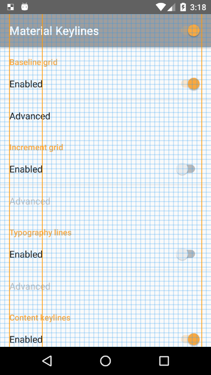

Material Keylines
=================

An Android overlay for Material design keylines.

Material design uses several grids and keylines to align its components. Use Material Keylines to display an overlay of these keylines on top of your application and analyze it.

Features
--------

The overlay can be composed of:

- A 8dp baseline grid
- An increment grid (48dp, 56dp or 64dp)
- The content keylines
- The typography lines (4dp)

Color, opacity and size of the grids/lines can be customized to fit your needs.

Screenshots
-----------

See the [screenshots](screenshots) folder for more.

Release
-------

Check out the [release page](https://github.com/AoDevBlue/MaterialKeylines/releases) to download the apk
or use the Play Store:

-----

© 2016 Ao (Matthieu Esnault) - Released under [Apache-2.0 License](https://raw.githubusercontent.com/AoDevBlue/MaterialKeylines/master/LICENSE)

